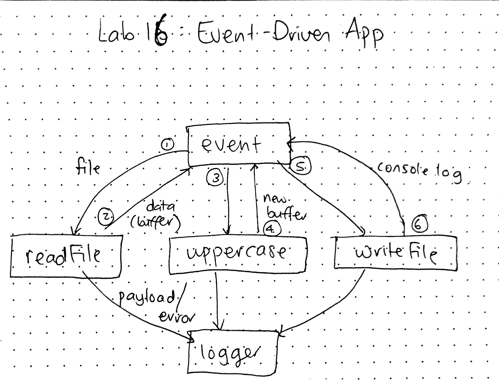

# LAB - 16

## Event-Driven App

### Author: Joanna Arroyo

### Links and Resources
* [submission PR](https://github.com/joanna-401-advanced-javascript/lab-16-event-driven-app/pull/1)
* [travis](https://travis-ci.com/joanna-401-advanced-javascript/lab-16-event-driven-app)

#### Documentation
* [jsdoc](https://joanna-lab-16.herokuapp.com/docs)
* [fs-extra docs](https://github.com/jprichardson/node-fs-extra/tree/e3d1ab855a17a223e7e8be89d100a5d0ebbdf98c)

### Modules
#### `app.js`
#### `events.js`
#### `logger.js`
#### `readFile.js`
#### `uppercase.js`
#### `writeFile.js`

##### Exported Values and Methods

###### `event() -> new event`

###### `writeFile(text) -> object`

### Setup

#### Running the app
* `node app.js <file name>`
  
#### Tests
* Unit test: `npm run test`
* Lint test: `npm run lint`

#### UML
